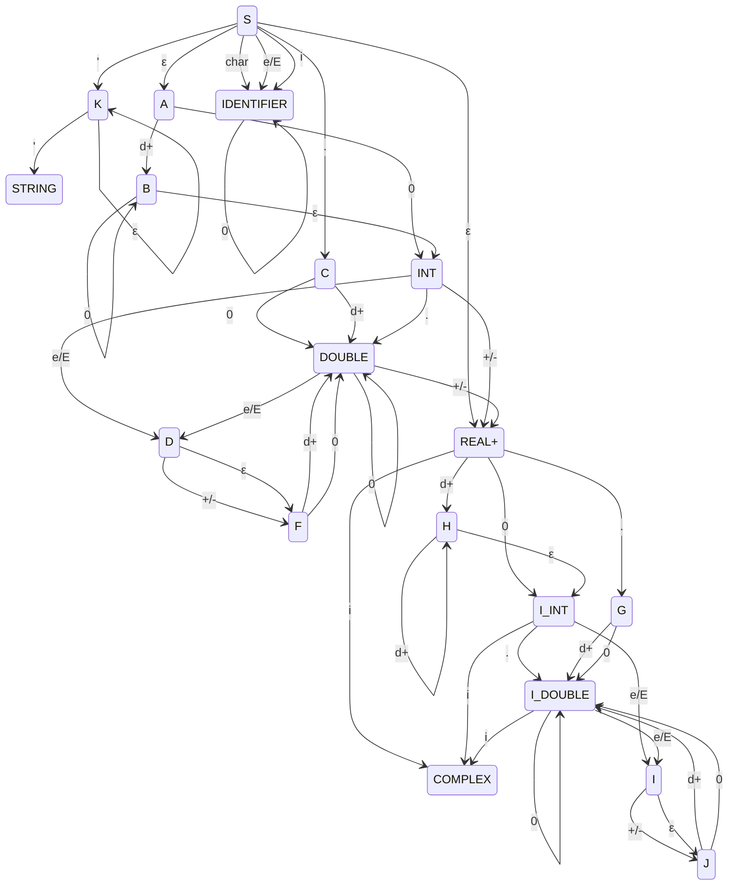
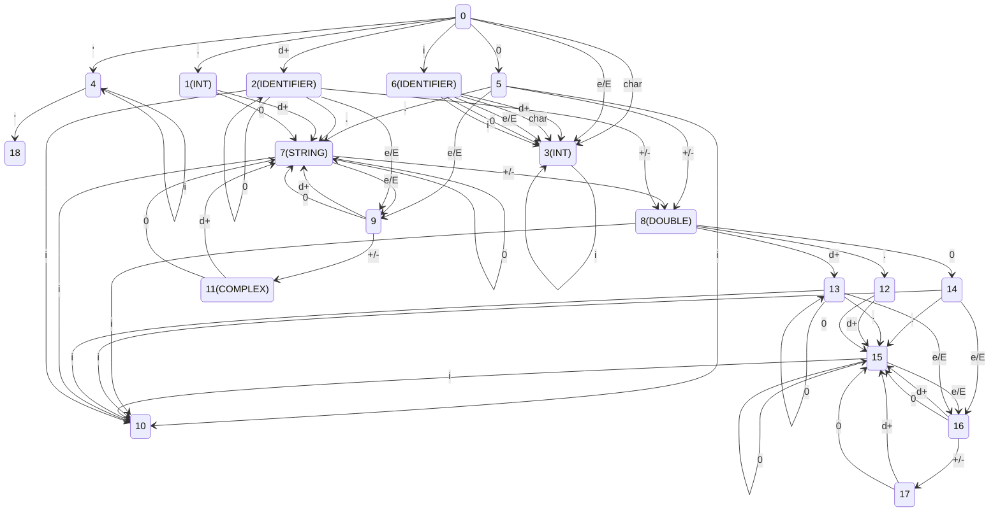

NFA

```mermaid
stateDiagram
S-->A:ε
S-->REAL+:ε
S-->C:.
S-->IDENTIFIER:char
S-->IDENTIFIER:e/E
S-->IDENTIFIER:i
S-->K:'
K-->K:i
K-->K:d+
K-->K:e/E
K-->K:char
K-->K:0
K-->K:ε
K-->STRING:'
IDENTIFIER-->IDENTIFIER:char
IDENTIFIER-->IDENTIFIER:i
IDENTIFIER-->IDENTIFIER:e/E
IDENTIFIER-->IDENTIFIER:d+
IDENTIFIER-->IDENTIFIER:0
A-->INT:0
A-->B:d+
B-->B:d+
B-->B:0
B-->INT:ε
C-->DOUBLE:0
C-->DOUBLE:d+
INT-->DOUBLE:.
DOUBLE-->DOUBLE:d+
DOUBLE-->DOUBLE:0
INT-->D:e/E
DOUBLE-->D:e/E
D-->F:+/-
D-->F:ε
F-->DOUBLE:d+
F-->DOUBLE:0
INT-->REAL+:+/-
DOUBLE-->REAL+:+/-
REAL+-->I_INT:0
REAL+-->H:d+
REAL+-->G:.
REAL+-->COMPLEX:i
H-->H:0
H-->H:d+
H-->I_INT:ε
I_INT-->I_DOUBLE:.
G-->I_DOUBLE:d+
G-->I_DOUBLE:0
I_DOUBLE-->I_DOUBLE:d+
I_DOUBLE-->I_DOUBLE:0
I_INT-->I:e/E
I_DOUBLE-->I:e/E
I-->J:+/-
I-->J:ε
J-->I_DOUBLE:d+
J-->I_DOUBLE:0
I_INT-->COMPLEX:i
I_DOUBLE-->COMPLEX:i
```

DFA

```mermaid
stateDiagram
0-->1(INT):.
0-->2(IDENTIFIER):d+
0-->3(INT):char
0-->3(INT):e/E
0-->4:'
0-->5:0
0-->6(IDENTIFIER):i
6(IDENTIFIER)-->3(INT):d+
6(IDENTIFIER)-->3(INT):char
6(IDENTIFIER)-->3(INT):e/E
6(IDENTIFIER)-->3(INT):0
6(IDENTIFIER)-->3(INT):i
5-->7(STRING):.
5-->8(DOUBLE):+/-
5-->9:e/E
5-->10:i
9-->7(STRING):d+
9-->11(COMPLEX):+/-
9-->7(STRING):0
11(COMPLEX)-->7(STRING):d+
11(COMPLEX)-->7(STRING):0
8(DOUBLE)-->12:.
8(DOUBLE)-->13:d+
8(DOUBLE)-->14:0
8(DOUBLE)-->10:i
14-->15:.
14-->16:e/E
14-->10:i
16-->15:d+
16-->17:+/-
16-->15:0
17-->15:d+
17-->15:0
15-->15:d+
15-->16:e/E
15-->15:0
15-->10:i
13-->15:.
13-->13:d+
13-->16:e/E
13-->13:0
13-->10:i
12-->15:d+
12-->15:0
7(STRING)-->7(STRING):d+
7(STRING)-->8(DOUBLE):+/-
7(STRING)-->9:e/E
7(STRING)-->7(STRING):0
7(STRING)-->10:i
4-->4:d+
4-->4:char
4-->4:e/E
4-->18:'
4-->4:0
4-->4:i
3(INT)-->3(INT):d+
3(INT)-->3(INT):char
3(INT)-->3(INT):e/E
3(INT)-->3(INT):0
3(INT)-->3(INT):i
2(IDENTIFIER)-->7(STRING):.
2(IDENTIFIER)-->2(IDENTIFIER):d+
2(IDENTIFIER)-->8(DOUBLE):+/-
2(IDENTIFIER)-->9:e/E
2(IDENTIFIER)-->2(IDENTIFIER):0
2(IDENTIFIER)-->10:i
1(INT)-->7(STRING):d+
1(INT)-->7(STRING):0

```

```mermaid
stateDiagram
0-->1:ids
0-->2:if
0-->3:def
0-->4:while
0-->5:Assignment
0-->6:Con
0-->7:Func
0-->8:Funcall
0-->9:Funcdef
0-->10:Loop
0-->11:S
0-->12:id
12-->13:.
13-->12:id
13-->14:ids
10-->1:ids
10-->2:if
10-->3:def
10-->4:while
10-->5:Assignment
10-->6:Con
10-->7:Func
10-->8:Funcall
10-->9:Funcdef
10-->10:Loop
10-->15:S
10-->12:id
9-->1:ids
9-->2:if
9-->3:def
9-->4:while
9-->5:Assignment
9-->6:Con
9-->7:Func
9-->8:Funcall
9-->9:Funcdef
9-->10:Loop
9-->16:S
9-->12:id
8-->1:ids
8-->2:if
8-->3:def
8-->4:while
8-->5:Assignment
8-->6:Con
8-->7:Func
8-->8:Funcall
8-->9:Funcdef
8-->10:Loop
8-->17:S
8-->12:id
7-->1:ids
7-->2:if
7-->3:def
7-->4:while
7-->5:Assignment
7-->6:Con
7-->7:Func
7-->8:Funcall
7-->9:Funcdef
7-->10:Loop
7-->18:S
7-->12:id
6-->1:ids
6-->2:if
6-->3:def
6-->4:while
6-->5:Assignment
6-->6:Con
6-->7:Func
6-->8:Funcall
6-->9:Funcdef
6-->10:Loop
6-->19:S
6-->12:id
5-->1:ids
5-->2:if
5-->3:def
5-->4:while
5-->5:Assignment
5-->6:Con
5-->7:Func
5-->8:Funcall
5-->9:Funcdef
5-->10:Loop
5-->20:S
5-->12:id
4-->21:(
21-->22:(
21-->23:Expr
21-->24:Funcall
21-->25:UnaryOp
21-->26:const
21-->27:id
21-->28:ids
28-->29:(
29-->30:const
29-->31:)
29-->32:Consts
32-->33:)
30-->34:,
34-->30:const
34-->35:Consts
27-->36:[
27-->37:.
37-->38:id
37-->39:ids
38-->37:.
36-->40:(
36-->41:Expr
36-->42:Funcall
36-->43:UnaryOp
36-->44:const
36-->45:id
36-->46:ids
46-->47:(
47-->30:const
47-->48:)
47-->49:Consts
49-->50:)
45-->51:[
45-->52:.
52-->53:id
52-->54:ids
53-->52:.
51-->40:(
51-->55:Expr
51-->42:Funcall
51-->43:UnaryOp
51-->44:const
51-->45:id
51-->46:ids
55-->56:BinaryOp
55-->57:]
56-->40:(
56-->58:Expr
56-->42:Funcall
56-->43:UnaryOp
56-->44:const
56-->59:id
56-->46:ids
59-->51:[
59-->60:.
60-->53:id
60-->61:ids
58-->56:BinaryOp
43-->40:(
43-->62:Expr
43-->42:Funcall
43-->43:UnaryOp
43-->44:const
43-->59:id
43-->46:ids
62-->56:BinaryOp
41-->56:BinaryOp
41-->63:]
40-->22:(
40-->64:Expr
40-->24:Funcall
40-->25:UnaryOp
40-->26:const
40-->27:id
40-->28:ids
64-->65:)
64-->66:BinaryOp
66-->22:(
66-->67:Expr
66-->24:Funcall
66-->25:UnaryOp
66-->26:const
66-->68:id
66-->28:ids
68-->36:[
68-->69:.
69-->38:id
69-->70:ids
67-->66:BinaryOp
25-->22:(
25-->71:Expr
25-->24:Funcall
25-->25:UnaryOp
25-->26:const
25-->68:id
25-->28:ids
71-->66:BinaryOp
23-->66:BinaryOp
23-->72:)
72-->73:{
73-->74:ids
73-->75:if
73-->76:def
73-->77:while
73-->78:S
73-->79:}
73-->80:Assignment
73-->81:Con
73-->82:Func
73-->83:Funcall
73-->84:Funcdef
73-->85:Loop
73-->12:id
85-->74:ids
85-->75:if
85-->76:def
85-->77:while
85-->80:Assignment
85-->81:Con
85-->82:Func
85-->83:Funcall
85-->84:Funcdef
85-->85:Loop
85-->86:S
85-->12:id
84-->74:ids
84-->75:if
84-->76:def
84-->77:while
84-->80:Assignment
84-->81:Con
84-->82:Func
84-->83:Funcall
84-->84:Funcdef
84-->85:Loop
84-->87:S
84-->12:id
83-->74:ids
83-->75:if
83-->76:def
83-->77:while
83-->80:Assignment
83-->81:Con
83-->82:Func
83-->83:Funcall
83-->84:Funcdef
83-->85:Loop
83-->88:S
83-->12:id
82-->74:ids
82-->75:if
82-->76:def
82-->77:while
82-->80:Assignment
82-->81:Con
82-->82:Func
82-->83:Funcall
82-->84:Funcdef
82-->85:Loop
82-->89:S
82-->12:id
81-->74:ids
81-->75:if
81-->76:def
81-->77:while
81-->80:Assignment
81-->81:Con
81-->82:Func
81-->83:Funcall
81-->84:Funcdef
81-->85:Loop
81-->90:S
81-->12:id
80-->74:ids
80-->75:if
80-->76:def
80-->77:while
80-->80:Assignment
80-->81:Con
80-->82:Func
80-->83:Funcall
80-->84:Funcdef
80-->85:Loop
80-->91:S
80-->12:id
78-->92:}
77-->93:(
93-->22:(
93-->94:Expr
93-->24:Funcall
93-->25:UnaryOp
93-->26:const
93-->27:id
93-->28:ids
94-->66:BinaryOp
94-->95:)
95-->96:{
96-->74:ids
96-->75:if
96-->76:def
96-->77:while
96-->97:S
96-->98:}
96-->80:Assignment
96-->81:Con
96-->82:Func
96-->83:Funcall
96-->84:Funcdef
96-->85:Loop
96-->12:id
97-->99:}
76-->100:id
100-->101:(
101-->102:)
101-->103:Paras
101-->104:id
104-->105:,
105-->104:id
105-->106:Paras
103-->107:)
107-->108:{
108-->74:ids
108-->75:if
108-->76:def
108-->109:S
108-->110:}
108-->77:while
108-->80:Assignment
108-->81:Con
108-->82:Func
108-->83:Funcall
108-->84:Funcdef
108-->85:Loop
108-->12:id
109-->111:}
102-->112:{
112-->74:ids
112-->75:if
112-->76:def
112-->113:S
112-->114:}
112-->77:while
112-->80:Assignment
112-->81:Con
112-->82:Func
112-->83:Funcall
112-->84:Funcdef
112-->85:Loop
112-->12:id
113-->115:}
75-->116:(
116-->117:Expr
116-->22:(
116-->24:Funcall
116-->25:UnaryOp
116-->26:const
116-->27:id
116-->28:ids
117-->118:)
117-->66:BinaryOp
118-->119:{
119-->74:ids
119-->75:if
119-->120:S
119-->121:}
119-->76:def
119-->77:while
119-->80:Assignment
119-->81:Con
119-->82:Func
119-->83:Funcall
119-->84:Funcdef
119-->85:Loop
119-->12:id
120-->122:}
74-->123:AssignmentOp
74-->124:(
124-->30:const
124-->125:)
124-->126:Consts
126-->127:)
123-->128:Expr
123-->129:(
123-->130:Funcall
123-->131:UnaryOp
123-->132:const
123-->133:id
123-->134:ids
134-->135:(
135-->30:const
135-->136:)
135-->137:Consts
137-->138:)
133-->139:[
133-->140:.
140-->141:id
140-->142:ids
141-->140:.
139-->40:(
139-->143:Expr
139-->42:Funcall
139-->43:UnaryOp
139-->44:const
139-->45:id
139-->46:ids
143-->56:BinaryOp
143-->144:]
131-->129:(
131-->145:Expr
131-->130:Funcall
131-->131:UnaryOp
131-->132:const
131-->146:id
131-->134:ids
146-->139:[
146-->147:.
147-->141:id
147-->148:ids
145-->149:BinaryOp
149-->129:(
149-->150:Expr
149-->130:Funcall
149-->131:UnaryOp
149-->132:const
149-->146:id
149-->134:ids
150-->149:BinaryOp
129-->22:(
129-->151:Expr
129-->24:Funcall
129-->25:UnaryOp
129-->26:const
129-->27:id
129-->28:ids
151-->152:)
151-->66:BinaryOp
128-->149:BinaryOp
22-->22:(
22-->153:Expr
22-->24:Funcall
22-->25:UnaryOp
22-->26:const
22-->27:id
22-->28:ids
153-->154:)
153-->66:BinaryOp
3-->155:id
155-->156:(
156-->157:)
156-->158:Paras
156-->104:id
158-->159:)
159-->160:{
160-->74:ids
160-->75:if
160-->76:def
160-->161:S
160-->162:}
160-->77:while
160-->80:Assignment
160-->81:Con
160-->82:Func
160-->83:Funcall
160-->84:Funcdef
160-->85:Loop
160-->12:id
161-->163:}
157-->164:{
164-->74:ids
164-->75:if
164-->76:def
164-->165:S
164-->166:}
164-->77:while
164-->80:Assignment
164-->81:Con
164-->82:Func
164-->83:Funcall
164-->84:Funcdef
164-->85:Loop
164-->12:id
165-->167:}
2-->168:(
168-->169:Expr
168-->22:(
168-->24:Funcall
168-->25:UnaryOp
168-->26:const
168-->27:id
168-->28:ids
169-->170:)
169-->66:BinaryOp
170-->171:{
171-->74:ids
171-->75:if
171-->172:S
171-->173:}
171-->76:def
171-->77:while
171-->80:Assignment
171-->81:Con
171-->82:Func
171-->83:Funcall
171-->84:Funcdef
171-->85:Loop
171-->12:id
172-->174:}
1-->175:AssignmentOp
1-->176:(
176-->30:const
176-->177:)
176-->178:Consts
178-->179:)
175-->180:Expr
175-->181:(
175-->182:Funcall
175-->183:UnaryOp
175-->184:const
175-->185:id
175-->186:ids
186-->187:(
187-->30:const
187-->188:)
187-->189:Consts
189-->190:)
185-->191:[
185-->192:.
192-->193:id
192-->194:ids
193-->195:.
195-->193:id
195-->196:ids
191-->40:(
191-->197:Expr
191-->42:Funcall
191-->43:UnaryOp
191-->44:const
191-->45:id
191-->46:ids
197-->56:BinaryOp
197-->198:]
183-->181:(
183-->199:Expr
183-->182:Funcall
183-->183:UnaryOp
183-->184:const
183-->200:id
183-->186:ids
200-->191:[
200-->201:.
201-->193:id
201-->202:ids
199-->203:BinaryOp
203-->181:(
203-->204:Expr
203-->182:Funcall
203-->183:UnaryOp
203-->184:const
203-->200:id
203-->186:ids
204-->203:BinaryOp
181-->22:(
181-->205:Expr
181-->24:Funcall
181-->25:UnaryOp
181-->26:const
181-->27:id
181-->28:ids
205-->206:)
205-->66:BinaryOp
180-->203:BinaryOp

```
